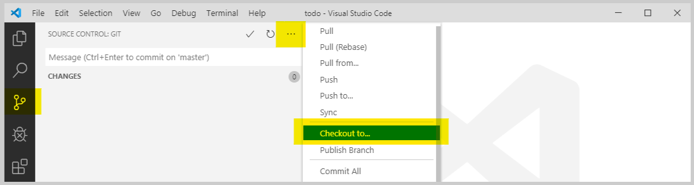

# Hello!
This project will help you start working with GitHub.   
:rocket: If you're new to Git, [this handbook](https://guides.github.com/introduction/git-handbook/) is a great intro.

# Get started
1. [Create your GitHub account](https://github.com/join).
1. [Download and install Git](https://git-scm.com/downloads) (use the install defaults).
1. [Download and install VS Code](https://code.visualstudio.com/download) (use the install defaults).
1. [Open a command prompt](https://www.wikihow.com/Open-the-Command-Prompt-in-Windows) and enter the following two commands:
```bash
git config --global user.name "Your Name"
git config --global user.email "your.name@canada.ca"
# Once you're done, you can close this command prompt
```

# Clone a repository
To work with GitHub, you need a local copy of the repository (or project) on your computer.

1. Open VS Code.
2. Press the `F1` key and type `Git: Clone`.  
3. Enter the repository URL: `https://github.com/dtf-ein/hello.git`.  You can also get this from GitHub:

4. Select the folder on your computer where you'll put the files.
5. Select `Open` when the clone is finished.

Now you have a local copy of the repository that matches the remote repository on GitHub.

# Create a new branch
We use the [GitHub flow](https://guides.github.com/introduction/flow/) to make changes, so the first step to making a change is creating a new branch.

1. Go to the `Source Control` view of VS Code in the vertical left menu, click the `...` link and select `Checkout to...`:

2. Select `Create new branch...` from the menu.
3. Enter the branch name and click `Enter`.

You're now working on a new branch of the repository.  All Git repositories have a main branch called `master`.  When you make changes in a new branch, it keeps your changes separate from the `master` branch until they're finished.  

# Make a change
1. Go back to the `Explorer` view of VS Code from the vertical left menu.
1. Open the `HELLO.md` [markdown file](https://guides.github.com/features/mastering-markdown/).
1. Add your name to the file and `Save`.  
1. If you want to see how it will look, press `F1` and type `Markdown: Open preview`.
1. Go back to the `Source Control` view.  You should now see `HELLO.md` in the list of changed files. 
1. Select `HELLO.md` to see that change you made.
1. If you're happy with the change, click the `+` that appears when you hover `HELLO.md` to stage the change.  This tells Git you are planning to save the change to your branch (with a commit).
1. Enter a message and press `CTRL + Enter` to commit the change:


You've just created a commit!  This is where Git shines.  It keeps a complete history of all changes (commits) made to a repository that you can browse whenever you want.

# Create a pull request
Now that you've made a change in your branch, it's time to move that change into the `master` branch of the repository so everyone can see it.  In Git, this is called merging your branch with `master` and GitHub uses **Pull Requests** to do this.

1. Go back to the `Source Control` view, click the same `...` link you used to create a branch and select `Push`.
1. Select `OK` to publish the branch.  This copies it from your local repository to the remote repository on GitHub.
1. Open a browser and go to the [repository on GitHub](https://github.com/dtf-ein/hello).
1. Click the green `Compare & pull request` button.
1. Update the pull request title and description to explain the change.  This lets other people know what you've done.
1. Click `Create pull request`.

The pull request can now be reviewed by other team members, and if everything looks good, it will get merged into `master`.  

# Merge a pull request
The final piece needed to make your change available to everyone working on the repository is to merge your pull request.

1. Go to the [pull requests page of this repository](https://github.com/dtf-ein/hello/pulls) and select your pull request.
1. Click the arrow next to the `Merge pull request` button and select `Rebase and merge`.
1. Click the `Rebase and merge` button and confirm the merge.

Your changes are now part of `master`!  You can also delete your branch.  In Git, it's a good idea to merge smaller changes more frequently, so it's normal to create a branch, make a single change and then delete the branch.

# Update your repository
As you're working on a repository, you'll also want to get other people's changes so you stay in sync with their work.  

1. In the `Source Control` view of VS Code, click the `...` link and select `Pull`.

# That's it!
You're now ready to start working in Git.  If you have any problems following this guide, let us know with [an issue](https://github.com/dtf-ein/hello/issues) or, even better, suggest a change with a pull request :wink:
